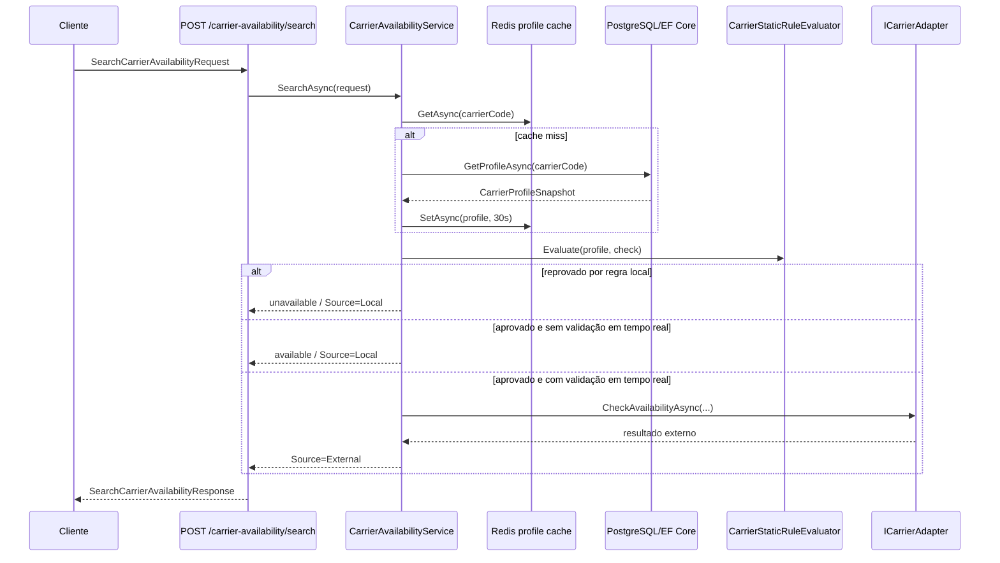

# CarrierService — Documentação do Microserviço

## Sumário

- [Visão geral](#visão-geral)
- [Responsabilidades do serviço](#responsabilidades-do-serviço)
- [Arquitetura e organização do código](#arquitetura-e-organização-do-código)
- [Tecnologias e dependências](#tecnologias-e-dependências)
- [Configuração](#configuração)
- [Como executar localmente](#como-executar-localmente)
- [Modelo de domínio](#modelo-de-domínio)
- [Regras de disponibilidade](#regras-de-disponibilidade)
- [API HTTP](#api-http)
- [Integrações externas](#integrações-externas)
- [Cache, persistência e outbox](#cache-persistência-e-outbox)
- [Health checks e worker de reconciliação](#health-checks-e-worker-de-reconciliação)
- [Observabilidade](#observabilidade)
- [Testes e validações](#testes-e-validações)
- [Troubleshooting](#troubleshooting)

## Visão geral

O `CarrierService` é um microserviço ASP.NET Core/.NET 8 responsável por administrar transportadoras e consultar disponibilidade logística para rotas, níveis de serviço e perfis de pacote.

O serviço combina validações locais de negócio com consultas em tempo real a parceiros externos quando a transportadora está configurada para exigir validação dinâmica. Ele expõe APIs HTTP minimalistas para:

- cadastro e consulta de transportadoras;
- inclusão de níveis de serviço;
- inclusão de rotas operacionais (*lanes*);
- alteração de status operacional;
- recebimento de webhook de status;
- busca de disponibilidade de transportadora;
- endpoints de saúde para *liveness* e *readiness*.

## Responsabilidades do serviço

### O que este microserviço faz

- Mantém o cadastro base de transportadoras (`Carrier`).
- Mantém níveis de serviço associados a uma transportadora (`CarrierServiceLevel`).
- Mantém rotas operacionais por origem, destino, janela de corte e dias de operação (`CarrierLane`).
- Avalia disponibilidade localmente usando status, rota, janela operacional, peso, peso cúbico, fragilidade, restrição e categoria do pacote.
- Consulta adaptadores externos quando a transportadora exige validação em tempo real.
- Armazena *snapshots* de perfil em Redis para reduzir leituras repetidas no banco.
- Registra eventos transacionais em uma tabela de outbox para integração assíncrona.
- Reconcilia periodicamente a saúde de transportadoras que exigem validação em tempo real.

### O que este microserviço não faz atualmente

- Não possui autenticação/autorização configurada no `Program.cs`.
- Não possui migrations do Entity Framework versionadas no repositório.
- Não possui pipeline de publicação, `Dockerfile` ou `docker-compose.yml` versionados no repositório atual.
- Não expõe endpoint `/metrics` ou instrumentação OpenTelemetry explícita no código atual.

## Arquitetura e organização do código

O projeto está organizado em camadas simples dentro de um único projeto `.csproj`:

```text
CarrierService/
├── Adapters/                 # Adaptadores HTTP para transportadoras/parceiros externos
├── Api/                      # Endpoints HTTP minimal APIs
├── Application/              # Serviços de aplicação, regras e portas
│   ├── Models/               # Snapshots usados por cache e regras
│   └── Ports/                # Interfaces de repositório, cache e outbox
├── Contracts/                # DTOs/records de entrada e saída da API
├── Domain/                   # Entidades e enums de domínio
├── Infrastructure/           # Persistência, Redis, outbox e worker
│   ├── Cache/
│   ├── Outbox/
│   ├── Persistence/
│   └── Workers/
├── Program.cs                # Bootstrap da aplicação e injeção de dependências
├── appsettings.json          # Configuração base
└── CarrierService.csproj     # Projeto .NET 8
```

### Fluxo principal de disponibilidade



## Tecnologias e dependências

- **Runtime/framework:** .NET 8 / ASP.NET Core Minimal APIs.
- **Persistência:** Entity Framework Core 8 com provedor PostgreSQL (`Npgsql.EntityFrameworkCore.PostgreSQL`).
- **Cache:** Redis via `Microsoft.Extensions.Caching.StackExchangeRedis`.
- **Resiliência HTTP:** `Microsoft.Extensions.Http.Resilience` com timeout, retry e circuit breaker.
- **Health checks:** `Microsoft.Extensions.Diagnostics.HealthChecks.EntityFrameworkCore`.
- **Documentação interativa:** Swagger/OpenAPI via `Swashbuckle.AspNetCore` habilitado em ambiente `Development`.

## Configuração

### Connection strings

O serviço lê as seguintes connection strings:

| Chave | Uso | Valor padrão no código |
|---|---|---|
| `ConnectionStrings:CarrierDb` | Banco PostgreSQL usado pelo EF Core | `Host=localhost;Port=5432;Database=carrier_service;Username=postgres;Password=postgres` |
| `ConnectionStrings:Redis` | Redis usado para cache de perfil de transportadora | `localhost:6379` |

Exemplo em `appsettings.Development.json`:

```json
{
  "ConnectionStrings": {
    "CarrierDb": "Host=localhost;Port=5432;Database=carrier_service;Username=postgres;Password=postgres",
    "Redis": "localhost:6379"
  },
  "Carriers": {
    "Meli": {
      "BaseUrl": "http://localhost:8081"
    },
    "External": {
      "BaseUrl": "http://localhost:8082"
    }
  },
  "Logging": {
    "LogLevel": {
      "Default": "Information",
      "Microsoft.AspNetCore": "Warning"
    }
  }
}
```

### URLs dos parceiros externos

| Chave | Adaptador | Valor padrão |
|---|---|---|
| `Carriers:Meli:BaseUrl` | `MeliLogisticsAdapter` | `http://localhost:8081` |
| `Carriers:External:BaseUrl` | `ExternalCarrierAdapter` | `http://localhost:8082` |

### Variáveis de ambiente equivalentes

Em ambientes containerizados ou plataformas cloud, as mesmas chaves podem ser configuradas por variáveis de ambiente usando `__` como separador:

```bash
export ConnectionStrings__CarrierDb='Host=postgres;Port=5432;Database=carrier_service;Username=postgres;Password=postgres'
export ConnectionStrings__Redis='redis:6379'
export Carriers__Meli__BaseUrl='http://meli-logistics:8080'
export Carriers__External__BaseUrl='http://external-carrier:8080'
export ASPNETCORE_ENVIRONMENT='Development'
```

## Como executar localmente

### Pré-requisitos

- .NET SDK 8.x.
- PostgreSQL acessível.
- Redis acessível.
- Opcional: mocks HTTP para parceiros externos nas portas configuradas.

### Restaurar, compilar e executar

```bash
dotnet restore
dotnet build
dotnet run --project CarrierService.csproj
```

Em ambiente `Development`, o Swagger UI fica disponível no endereço informado pelo Kestrel/launch profile, normalmente em:

```text
http://localhost:5247/swagger
```

> Observação: o arquivo `CarrierService.http` ainda contém um exemplo legado para `/weatherforecast/`, endpoint que não existe neste microserviço.

### Banco de dados

O `CarrierDbContext` está configurado para PostgreSQL, mas o repositório atual não contém migrations versionadas. Para ambientes novos, gere e aplique migrations antes de executar o serviço contra um banco limpo:

```bash
dotnet tool install --global dotnet-ef
dotnet ef migrations add InitialCreate
dotnet ef database update
```

Se a ferramenta `dotnet-ef` já estiver instalada, apenas execute `dotnet ef database update` após criar ou receber as migrations do projeto.

## Modelo de domínio

### Carrier

Representa uma transportadora.

| Campo | Descrição |
|---|---|
| `Id` | Identificador interno (`Guid`). |
| `Code` | Código único normalizado em maiúsculas. |
| `Name` | Nome da transportadora. |
| `Status` | Status operacional. |
| `RequiresRealTimeValidation` | Indica se a disponibilidade deve ser confirmada por adaptador externo. |
| `StatusUpdatedAt` | Data/hora da última alteração de status. |
| `CreatedAt` / `UpdatedAt` | Auditoria básica. |
| `ServiceLevels` | Níveis de serviço vinculados. |

### CarrierStatus

Valores possíveis:

| Valor | Significado operacional |
|---|---|
| `Active` | Transportadora apta a operar. |
| `Degraded` | Transportadora com degradação; a regra local reprova disponibilidade. |
| `Suspended` | Operação suspensa; a regra local reprova disponibilidade. |
| `Maintenance` | Em manutenção. Atualmente não há reprovação explícita por esse status no avaliador local. |
| `Inactive` | Inativa. Atualmente não há reprovação explícita por esse status no avaliador local. |

### CarrierServiceLevel

Representa um produto/modal de entrega da transportadora, por exemplo expresso, transferência interna ou última milha.

| Campo | Descrição |
|---|---|
| `Code` | Código normalizado em maiúsculas. |
| `Name` | Nome do nível de serviço. |
| `Mode` | Modal (`Road`, `Air`, `Rail`, `InternalTransfer`, `LastMile`). |
| `MaximumWeightKg` | Peso máximo permitido. |
| `MaximumCubicWeightKg` | Peso cúbico máximo permitido. |
| `SupportsFragileItems` | Se aceita itens frágeis. |
| `SupportsRestrictedItems` | Se aceita itens restritos. |
| `Priority` | Prioridade usada na ordenação da avaliação local. |
| `IsActive` | Indica se o nível de serviço está ativo. |
| `Lanes` | Rotas atendidas por esse nível de serviço. |
| `CategoryRestrictions` | Categorias bloqueadas. |

### CarrierLane

Representa uma rota operacional entre dois nós logísticos.

| Campo | Descrição |
|---|---|
| `OriginNodeId` | Nó de origem. |
| `DestinationNodeId` | Nó de destino. |
| `TimeZoneId` | Fuso horário usado para converter a data planejada de saída. |
| `CutoffTime` | Horário limite local para operação. |
| `OperatingDays` | Dias da semana atendidos. |
| `IsActive` | Indica se a rota está ativa. |

## Regras de disponibilidade

A busca de disponibilidade recebe uma lista de checagens e agrupa as requisições por `CarrierCode`. Para cada transportadora:

1. Busca o perfil no Redis.
2. Em caso de cache miss, carrega o perfil do PostgreSQL e grava no Redis com TTL de 30 segundos.
3. Executa regras locais no `CarrierStaticRuleEvaluator`.
4. Se a regra local reprovar, retorna indisponibilidade sem chamar parceiro externo.
5. Se a regra local aprovar e `RequiresRealTimeValidation=false`, retorna disponibilidade local com validade de 30 segundos.
6. Se a regra local aprovar e `RequiresRealTimeValidation=true`, chama o adaptador externo da transportadora.
7. Se não existir adaptador registrado para a transportadora, retorna `PartnerUnavailable`.
8. Se o parceiro falhar ou não retornar um item esperado, retorna indisponibilidade conforme o caso.

### Critérios locais avaliados

- Transportadora inexistente.
- Transportadora suspensa.
- Transportadora degradada.
- Nível de serviço inexistente quando informado.
- Rota origem/destino inexistente.
- Rota fora da janela operacional ou fora do dia de operação.
- Peso acima do máximo permitido.
- Peso cúbico acima do máximo permitido.
- Item frágil não suportado.
- Item restrito não suportado.
- Categoria bloqueada.

### Reason codes

Os resultados usam `ReasonCode` com valores derivados de `CarrierAvailabilityReason`:

| ReasonCode | Quando ocorre |
|---|---|
| `Available` | A checagem foi aprovada. |
| `CarrierNotFound` | A transportadora não foi encontrada. |
| `CarrierSuspended` | A transportadora está suspensa. |
| `CarrierDegraded` | A transportadora está degradada. |
| `ServiceLevelNotFound` | O nível de serviço informado não existe ou não está disponível. |
| `LaneNotSupported` | Nenhuma rota atende origem/destino. |
| `OutsideOperatingWindow` | Existe rota, mas a data/hora não atende dias ou cutoff. |
| `WeightExceeded` | Peso maior que o limite do serviço. |
| `CubicWeightExceeded` | Peso cúbico maior que o limite do serviço. |
| `FragileItemUnsupported` | Pacote frágil em serviço que não aceita frágil. |
| `RestrictedItemUnsupported` | Pacote restrito em serviço que não aceita restrito. |
| `CategoryUnsupported` | Categoria bloqueada para o serviço. |
| `PartnerRejected` | Parceiro externo rejeitou sem reason code específico. |
| `PartnerUnavailable` | Adaptador ausente, falha externa ou resposta externa incompleta. |

## API HTTP

A API usa JSON e serializa enums como strings.

### Health checks

#### `GET /health/live`

Verifica se o processo está vivo.

Resposta esperada:

```http
HTTP/1.1 200 OK
```

#### `GET /health/ready`

Verifica se dependências de prontidão estão saudáveis. Atualmente inclui o `CarrierDbContext`.

Resposta esperada quando o banco está acessível:

```http
HTTP/1.1 200 OK
```

#### `GET /health`

Executa health checks registrados sem filtro específico.

### Carrier Administration

#### `POST /carriers`

Cria uma transportadora.

Request:

```json
{
  "code": "MELI-LOGISTICS",
  "name": "Meli Logistics",
  "requiresRealTimeValidation": true
}
```

Responses:

- `201 Created`: transportadora criada.
- `400 Bad Request` ou `500 Internal Server Error`: entradas inválidas podem gerar exceções não tratadas explicitamente pelo endpoint.

Exemplo `curl`:

```bash
curl -i -X POST 'http://localhost:5247/carriers' \
  -H 'Content-Type: application/json' \
  -d '{
    "code": "MELI-LOGISTICS",
    "name": "Meli Logistics",
    "requiresRealTimeValidation": true
  }'
```

Ao criar, o serviço registra um evento `CarrierCreated` no outbox.

#### `GET /carriers/{carrierCode}`

Consulta o perfil/snapshot de uma transportadora.

Exemplo:

```bash
curl -i 'http://localhost:5247/carriers/MELI-LOGISTICS'
```

Responses:

- `200 OK`: retorna `CarrierProfileSnapshot`.
- `404 Not Found`: transportadora inexistente.

#### `PATCH /carriers/{carrierCode}/status`

Altera o status operacional da transportadora.

Request:

```json
{
  "status": "Degraded",
  "reason": "Aumento de latência no parceiro"
}
```

Exemplo:

```bash
curl -i -X PATCH 'http://localhost:5247/carriers/MELI-LOGISTICS/status' \
  -H 'Content-Type: application/json' \
  -d '{
    "status": "Degraded",
    "reason": "Aumento de latência no parceiro"
  }'
```

Responses:

- `204 No Content`: status alterado ou já estava no status solicitado.
- Pode lançar exceção se a transportadora não existir.

Ao alterar, o serviço:

- cria evento `CarrierStatusChanged` no outbox;
- persiste a alteração em transação;
- invalida o cache Redis do perfil.

#### `POST /carriers/{carrierCode}/webhooks/status`

Recebe evento externo de alteração de status.

Request:

```json
{
  "eventId": "evt-001",
  "status": "Active",
  "reason": "Operação normalizada",
  "occurredAt": "2026-06-10T12:00:00Z",
  "signature": "assinatura-do-provedor"
}
```

Exemplo:

```bash
curl -i -X POST 'http://localhost:5247/carriers/MELI-LOGISTICS/webhooks/status' \
  -H 'Content-Type: application/json' \
  -d '{
    "eventId": "evt-001",
    "status": "Active",
    "reason": "Operação normalizada",
    "occurredAt": "2026-06-10T12:00:00Z",
    "signature": "assinatura-do-provedor"
  }'
```

Response:

- `202 Accepted`: webhook aceito para processamento síncrono da alteração.

> Importante: embora o contrato tenha `Signature`, o código atual não valida assinatura, idempotência por `EventId` ou ordenação por `OccurredAt`.

#### `POST /carriers/{carrierCode}/service-levels`

Adiciona um nível de serviço à transportadora.

Request:

```json
{
  "code": "EXPRESS",
  "name": "Entrega Expressa",
  "mode": "Road",
  "maximumWeightKg": 30,
  "maximumCubicWeightKg": 50,
  "supportsFragileItems": true,
  "supportsRestrictedItems": false,
  "priority": 1
}
```

Exemplo:

```bash
curl -i -X POST 'http://localhost:5247/carriers/MELI-LOGISTICS/service-levels' \
  -H 'Content-Type: application/json' \
  -d '{
    "code": "EXPRESS",
    "name": "Entrega Expressa",
    "mode": "Road",
    "maximumWeightKg": 30,
    "maximumCubicWeightKg": 50,
    "supportsFragileItems": true,
    "supportsRestrictedItems": false,
    "priority": 1
  }'
```

Responses:

- `201 Created`: nível de serviço criado.
- `404 Not Found`: transportadora inexistente.

Ao criar, o serviço registra `CarrierServiceLevelChanged` no outbox e invalida o cache.

#### `POST /carriers/{carrierCode}/lanes`

Adiciona uma rota operacional a um nível de serviço.

Request:

```json
{
  "serviceLevelCode": "EXPRESS",
  "originNodeId": "11111111-1111-1111-1111-111111111111",
  "destinationNodeId": "22222222-2222-2222-2222-222222222222",
  "timeZoneId": "America/Sao_Paulo",
  "cutoffTime": "18:00:00",
  "operatingDays": ["Monday", "Tuesday", "Wednesday", "Thursday", "Friday"]
}
```

Exemplo:

```bash
curl -i -X POST 'http://localhost:5247/carriers/MELI-LOGISTICS/lanes' \
  -H 'Content-Type: application/json' \
  -d '{
    "serviceLevelCode": "EXPRESS",
    "originNodeId": "11111111-1111-1111-1111-111111111111",
    "destinationNodeId": "22222222-2222-2222-2222-222222222222",
    "timeZoneId": "America/Sao_Paulo",
    "cutoffTime": "18:00:00",
    "operatingDays": ["Monday", "Tuesday", "Wednesday", "Thursday", "Friday"]
  }'
```

Responses:

- `201 Created`: rota criada.
- `404 Not Found`: transportadora ou nível de serviço inexistente.

Ao criar, o serviço registra `CarrierLaneActivated` no outbox e invalida o cache.

### Carrier Availability

#### `POST /carrier-availability/search`

Consulta disponibilidade para uma ou mais checagens.

Request:

```json
{
  "checks": [
    {
      "checkId": "check-001",
      "carrierCode": "MELI-LOGISTICS",
      "serviceLevelCode": "EXPRESS",
      "originNodeId": "11111111-1111-1111-1111-111111111111",
      "destinationNodeId": "22222222-2222-2222-2222-222222222222",
      "destinationPostalCode": "01001-000",
      "plannedDepartureAtUtc": "2026-06-10T20:30:00Z",
      "package": {
        "weightKg": 10.5,
        "cubicWeightKg": 12.0,
        "isFragile": false,
        "isRestricted": false,
        "category": "electronics"
      }
    }
  ]
}
```

Response:

```json
{
  "results": [
    {
      "checkId": "check-001",
      "carrierCode": "MELI-LOGISTICS",
      "serviceLevelCode": "EXPRESS",
      "available": true,
      "reasonCode": "Available",
      "source": "External",
      "evaluatedAt": "2026-06-10T20:30:01.0000000+00:00",
      "validUntil": "2026-06-10T20:35:01.0000000+00:00"
    }
  ]
}
```

Exemplo:

```bash
curl -i -X POST 'http://localhost:5247/carrier-availability/search' \
  -H 'Content-Type: application/json' \
  -d '{
    "checks": [
      {
        "checkId": "check-001",
        "carrierCode": "MELI-LOGISTICS",
        "serviceLevelCode": "EXPRESS",
        "originNodeId": "11111111-1111-1111-1111-111111111111",
        "destinationNodeId": "22222222-2222-2222-2222-222222222222",
        "destinationPostalCode": "01001-000",
        "plannedDepartureAtUtc": "2026-06-10T20:30:00Z",
        "package": {
          "weightKg": 10.5,
          "cubicWeightKg": 12.0,
          "isFragile": false,
          "isRestricted": false,
          "category": "electronics"
        }
      }
    ]
  }'
```

Validações básicas da requisição:

- `checks` não pode ser vazio.
- `checkId` é obrigatório.
- `carrierCode` é obrigatório.
- `originNodeId` e `destinationNodeId` não podem ser `Guid.Empty`.
- `plannedDepartureAtUtc` não pode ser `DateTimeOffset.MinValue`.
- `package.weightKg` deve ser maior que zero.
- `package.cubicWeightKg` não pode ser negativo.

## Integrações externas

### Adaptadores registrados

| CarrierCode | Classe | Disponibilidade | Health |
|---|---|---|---|
| `MELI-LOGISTICS` | `MeliLogisticsAdapter` | `POST /internal/logistics/availability` | `GET /health/ready` |
| `EXTERNAL-CARRIER` | `ExternalCarrierAdapter` | `POST /v1/serviceability/batch` | `GET /health` |

### MeliLogisticsAdapter

Envia o payload `{ checks }` para `/internal/logistics/availability` e espera uma lista de `ExternalCarrierAvailabilityResult`.

### ExternalCarrierAdapter

Transforma o contrato interno para o formato do provedor externo:

- remove caracteres não numéricos do CEP;
- converte peso e peso cúbico para gramas com arredondamento para cima;
- envia `X-Correlation-Id` com um GUID sem hífens;
- mapeia `reference`, `serviceable`, `reason` e `validUntil` da resposta para o contrato interno.

### Políticas de resiliência HTTP

Os `HttpClient`s dos adaptadores usam `AddStandardResilienceHandler` com:

| Adaptador | Timeout total | Timeout por tentativa | Retry máximo | Failure ratio | Minimum throughput | Sampling duration | Break duration |
|---|---:|---:|---:|---:|---:|---:|---:|
| `MeliLogisticsAdapter` | 3s | 2s | 1 | 0,5 | 10 | 30s | 20s |
| `ExternalCarrierAdapter` | 3s | 2s | 1 | 0,4 | 8 | 30s | 30s |

O bootstrap valida que o timeout total é maior que o timeout por tentativa e que a janela de amostragem do circuit breaker é ao menos o dobro do timeout por tentativa.

## Cache, persistência e outbox

### Persistência

O `CarrierDbContext` possui os seguintes `DbSet`s:

- `Carriers`
- `ServiceLevels`
- `Lanes`
- `CategoryRestrictions`
- `Incidents`
- `OutboxMessages`

Índices e constraints principais:

- `Carrier.Code` único.
- Índice composto único para `CarrierServiceLevel(CarrierId, Code)`.
- Índice de `CarrierLane` por origem e destino.
- Índice de `OutboxMessage` por `ProcessedAt` e `OccurredAt`.

### Cache Redis

O cache de perfil usa chave:

```text
carrier-profile:{carrierCodeNormalizado}
```

O TTL de cache usado pela busca de disponibilidade é de 30 segundos. Alterações de status, níveis de serviço e lanes removem a chave do cache da transportadora.

### Outbox

Eventos gravados atualmente:

| Evento | Quando é gravado |
|---|---|
| `CarrierCreated` | Criação de transportadora. |
| `CarrierStatusChanged` | Alteração de status. |
| `CarrierServiceLevelChanged` | Criação de nível de serviço. |
| `CarrierLaneActivated` | Criação de lane. |

A tabela de outbox armazena tipo do evento, payload JSON, data de ocorrência e data de processamento. O projeto atual grava mensagens, mas não contém um worker/publicador de outbox implementado.

## Health checks e worker de reconciliação

### Endpoints internos do serviço

- `/health/live`: valida apenas o check `self`.
- `/health/ready`: valida checks com tag `ready`, atualmente o `CarrierDbContext`.
- `/health`: executa checks registrados.

### CarrierHealthRefreshWorker

O worker em background executa um ciclo periódico de reconciliação:

- aguarda 15 segundos entre ciclos;
- busca transportadoras com `RequiresRealTimeValidation=true` e status `Active` ou `Degraded`;
- localiza o adaptador pelo código da transportadora;
- chama o health endpoint do parceiro;
- altera status para `Active` se saudável;
- altera status para `Degraded` se não saudável ou se a chamada falhar.

## Observabilidade

O projeto usa logging padrão do ASP.NET Core conforme `Logging:LogLevel` nos arquivos `appsettings`. Pontos relevantes de log:

- falha em chamada de disponibilidade externa;
- status HTTP não saudável retornado por parceiro;
- falha em ciclo de reconciliação de health;
- falha no health check individual de transportadora.

Para produção, recomenda-se complementar com:

- correlação por `traceId`/`correlationId` em todas as entradas HTTP;
- métricas de latência e taxa de erro por transportadora;
- métricas de cache hit/miss;
- métricas e alertas para outbox não processado;
- tracing distribuído nas chamadas para parceiros.

## Testes e validações

O repositório atual não possui projeto de testes automatizados. Ainda assim, os seguintes comandos são úteis para validação local:

```bash
dotnet restore
dotnet build
```

Sugestões de cobertura a adicionar:

- testes unitários para `CarrierStaticRuleEvaluator`;
- testes unitários para normalização e validação de entidades de domínio;
- testes de integração para endpoints de administração;
- testes de integração com PostgreSQL e Redis via containers;
- testes com mocks HTTP para `MeliLogisticsAdapter` e `ExternalCarrierAdapter`;
- testes de contrato para os payloads de disponibilidade e webhooks.

## Troubleshooting

### `Connection refused` ao iniciar

Verifique se PostgreSQL e Redis estão ativos e se as connection strings estão corretas:

```bash
printenv | grep ConnectionStrings
```

### `/health/ready` retorna não saudável

O readiness depende do `CarrierDbContext`. Verifique:

- disponibilidade do PostgreSQL;
- nome do banco;
- usuário e senha;
- migrations aplicadas;
- conectividade de rede entre aplicação e banco.

### Busca retorna `CarrierNotFound`

Confirme se a transportadora foi criada e se o `carrierCode` enviado na busca corresponde ao código normalizado.

### Busca retorna `LaneNotSupported`

Confirme se há lane ativa para:

- `originNodeId`;
- `destinationNodeId`;
- `serviceLevelCode`, quando informado.

### Busca retorna `OutsideOperatingWindow`

Confirme:

- `plannedDepartureAtUtc` em UTC;
- `timeZoneId` da lane;
- `cutoffTime` local;
- dias de operação configurados em `operatingDays`.

### Busca retorna `PartnerUnavailable`

Possíveis causas:

- `RequiresRealTimeValidation=true`, mas não há adaptador registrado para o `carrierCode`.
- Parceiro externo indisponível.
- Resposta externa não contém resultado para o `checkId` solicitado.
- Circuit breaker/timeout/retry esgotados.

### Webhook aceita assinatura inválida

O contrato contém campo `signature`, mas o código atual não valida assinatura. Se o endpoint for exposto fora de uma rede confiável, implemente validação criptográfica, idempotência por `eventId` e proteção contra replay.

## Roadmap técnico recomendado

- Adicionar migrations EF Core versionadas.
- Corrigir/remover `CarrierService.http` legado de weather forecast.
- Adicionar projeto de testes unitários e integração.
- Implementar publicador de outbox.
- Implementar autenticação/autorização para endpoints administrativos.
- Validar assinatura e idempotência de webhooks.
- Adicionar OpenTelemetry, métricas Prometheus e dashboards.
- Documentar contratos externos com exemplos reais de resposta.
- Padronizar tratamento de exceções e respostas `ProblemDetails` para erros de domínio.
